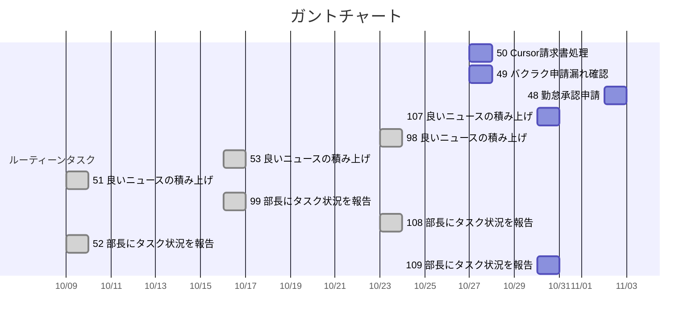

# ガントチャート

```mermaid
%%{init: {'themeCSS': 'rect[id*=rel] { fill: #c2410c !important; stroke: #9a3412 !important; }'}}%%
gantt
    title ガントチャート
    dateFormat YYYY-MM-DD
    axisFormat %m/%d
    section ルーティーンタスク
    50 Cursor請求書処理 :t1, 2026-10-27, 1d
    49 バクラク申請漏れ確認 :t2, 2026-10-27, 1d
    48 勤怠承認申請 :t3, 2026-11-02, 1d
    107 良いニュースの積み上げ :t4, 2026-10-30, 1d
    98 良いニュースの積み上げ :done, t5, 2026-10-23, 1d
    53 良いニュースの積み上げ :done, t6, 2026-10-16, 1d
    51 良いニュースの積み上げ :done, t7, 2026-10-09, 1d
    99 部長にタスク状況を報告 :done, t8, 2026-10-16, 1d
    108 部長にタスク状況を報告 :done, t9, 2026-10-23, 1d
    52 部長にタスク状況を報告 :done, t10, 2026-10-09, 1d
    109 部長にタスク状況を報告 :t11, 2026-10-30, 1d
```
