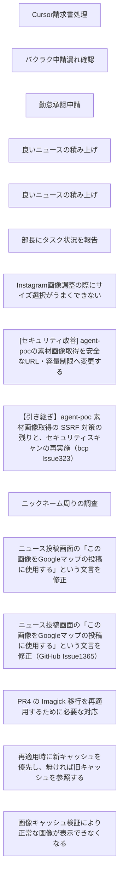

# 依存関係図

```mermaid
flowchart LR
    T0["Cursor請求書処理"]
    T1["バクラク申請漏れ確認"]
    T2["勤怠承認申請"]
    T3["良いニュースの積み上げ"]
    T4["良いニュースの積み上げ"]
    T5["部長にタスク状況を報告"]
    T6["Instagram画像調整の際にサイズ選択がうまくできない"]
    T7["[セキュリティ改善] agent-pocの素材画像取得を安全なURL・容量制限へ変更する"]
    T8["【引き継ぎ】agent-poc 素材画像取得の SSRF 対策の残りと、セキュリティスキャンの再実施（bcp Issue323）"]
    T9["ニックネーム周りの調査"]
    T10["ニュース投稿画面の「この画像をGoogleマップの投稿に使用する」という文言を修正"]
    T11["ニュース投稿画面の「この画像をGoogleマップの投稿に使用する」という文言を修正（GitHub Issue1365）"]
    T12["PR4 の Imagick 移行を再適用するために必要な対応"]
    T13["再適用時に新キャッシュを優先し、無ければ旧キャッシュを参照する"]
    T14["画像キャッシュ検証により正常な画像が表示できなくなる"]
```
