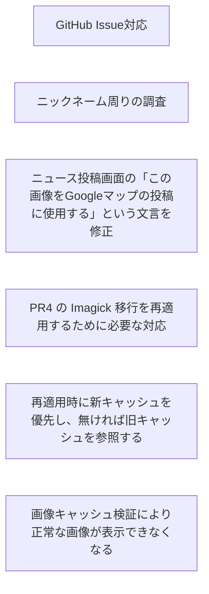

# 依存関係図

```mermaid
flowchart LR
    T0["GitHub Issue対応"]
    T1["ニックネーム周りの調査"]
    T2["ニュース投稿画面の「この画像をGoogleマップの投稿に使用する」という文言を修正"]
    T3["PR4 の Imagick 移行を再適用するために必要な対応"]
    T4["再適用時に新キャッシュを優先し、無ければ旧キャッシュを参照する"]
    T5["画像キャッシュ検証により正常な画像が表示できなくなる"]
```
