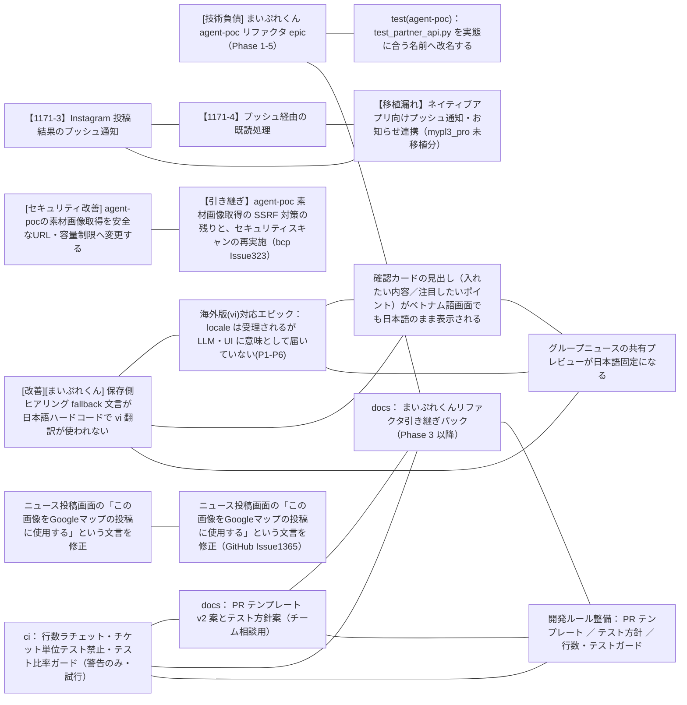

# 関連図

```mermaid
flowchart LR
    T0["[技術負債] まいぷれくん agent-poc リファクタ epic（Phase 1-5）"]
    T1["test(agent-poc)： test_partner_api.py を実態に合う名前へ改名する"]
    T2["[改善][まいぷれくん] 保存側ヒアリング fallback 文言が日本語ハードコードで vi 翻訳が使われない"]
    T3["海外版(vi)対応エピック： locale は受理されるが LLM・UI に意味として届いていない(P1-P6)"]
    T4["確認カードの見出し（入れたい内容／注目したいポイント）がベトナム語画面でも日本語のまま表示される"]
    T5["【1171-3】Instagram 投稿結果のプッシュ通知"]
    T6["【1171-4】プッシュ経由の既読処理"]
    T7["【移植漏れ】ネイティブアプリ向けプッシュ通知・お知らせ連携（mypl3_pro 未移植分）"]
    T8["グループニュースの共有プレビューが日本語固定になる"]
    T9["[セキュリティ改善] agent-pocの素材画像取得を安全なURL・容量制限へ変更する"]
    T10["【引き継ぎ】agent-poc 素材画像取得の SSRF 対策の残りと、セキュリティスキャンの再実施（bcp Issue323）"]
    T11["ニュース投稿画面の「この画像をGoogleマップの投稿に使用する」という文言を修正"]
    T12["ニュース投稿画面の「この画像をGoogleマップの投稿に使用する」という文言を修正（GitHub Issue1365）"]
    T13["ci： 行数ラチェット・チケット単位テスト禁止・テスト比率ガード（警告のみ・試行）"]
    T14["docs： PR テンプレート v2 案とテスト方針案（チーム相談用）"]
    T15["docs： まいぷれくんリファクタ引き継ぎパック（Phase 3 以降）"]
    T16["開発ルール整備： PR テンプレート ／ テスト方針 ／ 行数・テストガード"]
    T0 --- T1
    T0 --- T15
    T2 --- T3
    T2 --- T4
    T2 --- T8
    T3 --- T4
    T3 --- T8
    T4 --- T8
    T5 --- T6
    T5 --- T7
    T6 --- T7
    T9 --- T10
    T11 --- T12
    T13 --- T14
    T13 --- T15
    T13 --- T16
    T14 --- T15
    T14 --- T16
    T15 --- T16
```
