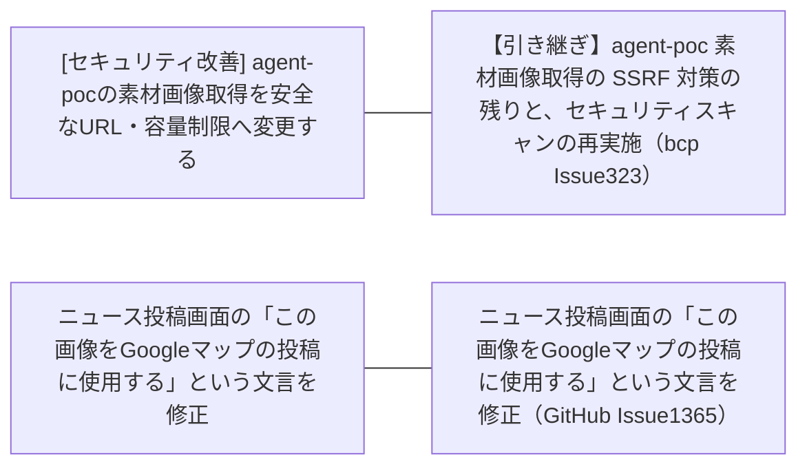

# 関連図

```mermaid
flowchart LR
    T0["[セキュリティ改善] agent-pocの素材画像取得を安全なURL・容量制限へ変更する"]
    T1["【引き継ぎ】agent-poc 素材画像取得の SSRF 対策の残りと、セキュリティスキャンの再実施（bcp Issue323）"]
    T2["ニュース投稿画面の「この画像をGoogleマップの投稿に使用する」という文言を修正"]
    T3["ニュース投稿画面の「この画像をGoogleマップの投稿に使用する」という文言を修正（GitHub Issue1365）"]
    T0 --- T1
    T2 --- T3
```
