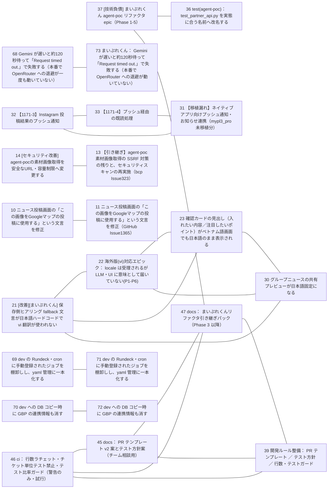

# 関連図

```mermaid
flowchart LR
    T0["68 Gemini が遅いと約120秒待って「Request timed out.」で失敗する（本番で OpenRouter への退避が一度も動いていない）"]
    T1["37 [技術負債] まいぷれくん agent-poc リファクタ epic（Phase 1-5）"]
    T2["36 test(agent-poc)： test_partner_api.py を実態に合う名前へ改名する"]
    T3["21 [改善][まいぷれくん] 保存側ヒアリング fallback 文言が日本語ハードコードで vi 翻訳が使われない"]
    T4["73 まいぷれくん： Gemini が遅いと約120秒待って「Request timed out.」で失敗する（本番で OpenRouter への退避が動いていない）"]
    T5["22 海外版(vi)対応エピック： locale は受理されるが LLM・UI に意味として届いていない(P1-P6)"]
    T6["23 確認カードの見出し（入れたい内容／注目したいポイント）がベトナム語画面でも日本語のまま表示される"]
    T7["32 【1171-3】Instagram 投稿結果のプッシュ通知"]
    T8["33 【1171-4】プッシュ経由の既読処理"]
    T9["31 【移植漏れ】ネイティブアプリ向けプッシュ通知・お知らせ連携（mypl3_pro 未移植分）"]
    T10["30 グループニュースの共有プレビューが日本語固定になる"]
    T11["14 [セキュリティ改善] agent-pocの素材画像取得を安全なURL・容量制限へ変更する"]
    T12["13 【引き継ぎ】agent-poc 素材画像取得の SSRF 対策の残りと、セキュリティスキャンの再実施（bcp Issue323）"]
    T13["10 ニュース投稿画面の「この画像をGoogleマップの投稿に使用する」という文言を修正"]
    T14["11 ニュース投稿画面の「この画像をGoogleマップの投稿に使用する」という文言を修正（GitHub Issue1365）"]
    T15["69 dev の Rundeck・cron に手動登録されたジョブを棚卸しし、yaml 管理に一本化する"]
    T16["70 dev への DB コピー時に GBP の連携情報も消す"]
    T17["46 ci： 行数ラチェット・チケット単位テスト禁止・テスト比率ガード（警告のみ・試行）"]
    T18["71 dev の Rundeck・cron に手動登録されたジョブを棚卸しし、yaml 管理に一本化する"]
    T19["72 dev への DB コピー時に GBP の連携情報も消す"]
    T20["45 docs： PR テンプレート v2 案とテスト方針案（チーム相談用）"]
    T21["47 docs： まいぷれくんリファクタ引き継ぎパック（Phase 3 以降）"]
    T22["39 開発ルール整備： PR テンプレート ／ テスト方針 ／ 行数・テストガード"]
    T0 --- T4
    T1 --- T2
    T1 --- T21
    T3 --- T5
    T3 --- T6
    T3 --- T10
    T5 --- T6
    T5 --- T10
    T6 --- T10
    T7 --- T8
    T7 --- T9
    T8 --- T9
    T11 --- T12
    T13 --- T14
    T15 --- T18
    T16 --- T19
    T17 --- T20
    T17 --- T21
    T17 --- T22
    T20 --- T21
    T20 --- T22
    T21 --- T22
```
